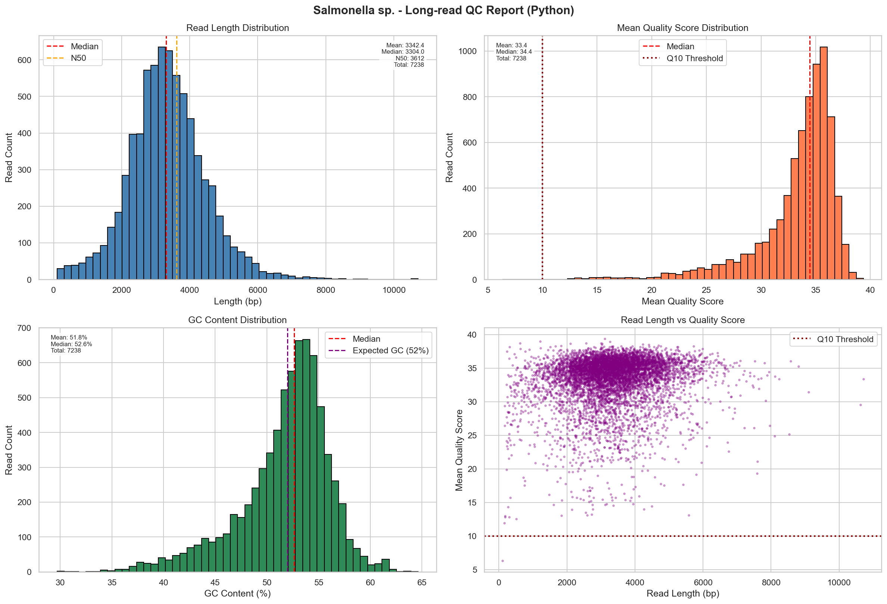
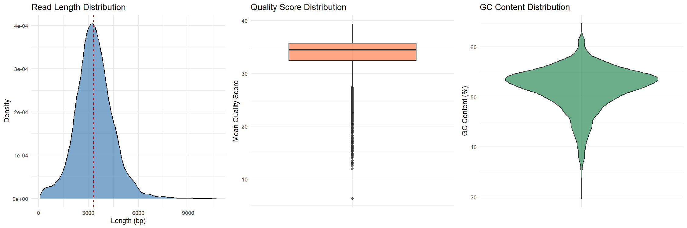
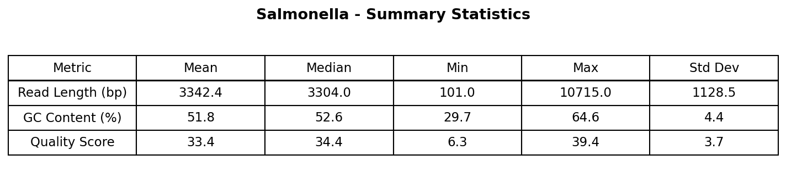

# Reproducible Bioinformatics Pipeline for Long-Read QC

## Overview

This project implements a reproducible bioinformatics pipeline for performing quality control (QC) on long-read sequencing data.

The pipeline takes a FASTQ file as input and performs the following steps:

- Long-read specific QC using NanoQC
- Calculates read-level statistics:
  - GC content
  - Read length
  - Mean quality score
- Generates summary statistics
- Creates visualizations of key sequencing metrics

The workflow is implemented using Snakemake and runs inside a Conda environment to ensure reproducibility.

---

## Results & Interpretation

| Metric             | Value                          |
|--------------------|--------------------------------|
| Total Reads        | 7,238                          |
| Mean Read Length   | 3,342 bp                       |
| Median Read Length | 3,304 bp                       |
| N50                | 3,612 bp                       |
| Mean GC Content    | 51.8%                          |
| Mean Quality Score | 33.4 (Q33.4 = 99.95% accuracy) |

### Key Findings

- **Read Length:** Mean 3,342 bp, N50 3,612 bp — typical for Nanopore long-read sequencing. Maximum read length reached 10,715 bp.
- **GC Content:** 51.8% — consistent with the known Salmonella genome composition (~52%). Narrow distribution (Std Dev 4.4%) indicates no major contamination or bias.
- **Quality Scores:** Mean Q33.4 (99.95% accuracy) — well above the minimum acceptable threshold of Q10. The majority of reads cluster between Q30–Q38.

Overall, the data shows stable read length distribution, expected GC content, and high base-calling quality — suitable for downstream genomic analysis.

### Visual Assessment




| Plot | Description |
|------|-------------|
| Read Length Distribution | Histogram with Median and N50 markers |
| Mean Quality Score Distribution | Histogram with Q10 threshold |
| GC Content Distribution | Histogram with expected GC (52%) line |
| Read Length vs Quality Score | Scatter plot showing correlation |




| Plot | Description |
|------|-------------|
| Read Length Distribution | Density plot with median line |
| Quality Score Distribution | Boxplot |
| GC Content Distribution | Violin plot |




---

## Project Structure

```
bioinfo-pipeline
│
├── Snakefile
├── environment.yml
├── README.md
│
├── data
│   └── salmonella.fastq
│
├── scripts
│   ├── analyze_reads.py
│   ├── visualize.py
│   └── visualize.R
│
└── results
    ├── nanoqc_report/
    │   └── nanoQC.html
    ├── read_stats.csv
    ├── summary_stats.csv
    ├── report.xlsx
    ├── summary_table.png
    ├── qc_plots_python.png
    └── qc_plots_R.png
```

---

## Requirements

- Conda / Miniconda
- Snakemake

All required dependencies are defined in the environment.yml file.

---

## Installation

```
conda env create -f environment.yml
conda activate bioinfo-pipeline
```

---

## Running the Pipeline

Preview the workflow:
```
snakemake -n
```

Run the pipeline:
```
snakemake --cores 1 --latency-wait 30
```

---

## Output Files

| File                        | Description                          |
|-----------------------------|--------------------------------------|
| nanoqc_report/nanoQC.html   | Long-read QC visualization report    |
| read_stats.csv              | Read-level statistics                |
| summary_stats.csv           | Summary statistics                   |
| report.xlsx                 | Excel report                         |
| summary_table.png           | Summary statistics table (PNG)       |
| qc_plots_python.png         | QC plots generated with Python       |
| qc_plots_R.png              | QC plots generated with R            |

---

## Methods

- **NanoQC:** Long-read specific quality control tool for initial data assessment
- **Python (Biopython, Pandas):** calculates read-level statistics
- **Python (Matplotlib, Seaborn):** generates visualizations
- **R (ggplot2, gridExtra):** additional graphical summaries
- **Snakemake:** workflow automation and reproducibility
- **Conda:** environment management

---

## Recommendation

Based on the QC results, the data is suitable for downstream genomic analysis including reference-based alignment and variant calling.

---

## Repository

GitHub: [https://github.com/ceylintopkaya/salmonella-longread-qc-pipeline](https://github.com/ceylintopkaya/salmonella-longread-qc-pipeline)
---

## Author

Ceylin Topkaya